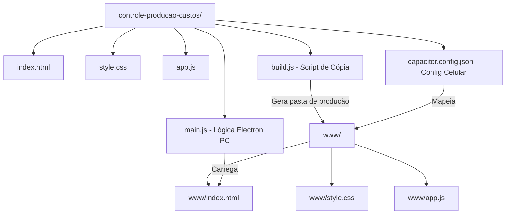

# Plano de Implementação: Empacotamento Multiplataforma (PC & Celular)

Este plano descreve as etapas para transformar o aplicativo web de controle de custos da **Agri Doce** em um aplicativo instalado nativo para **PC (usando Electron)** e **Celular (usando Capacitor)**.

## Arquitetura de Distribuição

Para manter a organização, os arquivos originais do site continuam na raiz da pasta `controle-producao-custos/`. Criaremos um script de build automatizado que copia apenas os arquivos de produção necessários para uma subpasta chamada `www/`. O Electron e o Capacitor lerão a partir dessa pasta compilada, isolando os arquivos de configuração do Node.js e as dependências de desenvolvimento.

---

## Modificações e Novos Arquivos

### [Componente: Empacotamento Desktop (Electron) & Mobile (Capacitor)]

#### [NEW] [package.json](file:///c:/Users/artsc/Desktop/CLIENTES/SITE%20ANTIGRAVITY/SITE%20LAIS/controle-producao-custos/package.json)
Arquivo de configuração do Node.js contendo as dependências do Electron e Capacitor, além de scripts automatizados para executar e compilar.

#### [NEW] [build.js](file:///c:/Users/artsc/Desktop/CLIENTES/SITE%20ANTIGRAVITY/SITE%20LAIS/controle-producao-custos/build.js)
Script em Node.js para criar a pasta `www/` e copiar os arquivos necessários de produção, garantindo isolamento.

#### [NEW] [main.js](file:///c:/Users/artsc/Desktop/CLIENTES/SITE%20ANTIGRAVITY/SITE%20LAIS/controle-producao-custos/main.js)
Ponto de entrada do Electron para gerenciar a janela desktop do aplicativo no PC.

#### [NEW] [capacitor.config.json](file:///c:/Users/artsc/Desktop/CLIENTES/SITE%20ANTIGRAVITY/SITE%20LAIS/controle-producao-custos/capacitor.config.json)
Configuração do Capacitor para mapeamento e criação dos projetos nativos de celular (Android/iOS).

---

## Etapas de Execução

1. **Estruturar Arquivos**: Criar `package.json`, `build.js`, `main.js` e `capacitor.config.json` na pasta `controle-producao-custos/`.
2. **Instalar Dependências**: Executar `npm install` na pasta do projeto para baixar as dependências do Electron e Capacitor.
3. **Gerar Pasta Web (`www`)**: Rodar `npm run build` para consolidar os arquivos de produção na pasta de destino.
4. **Testar no PC (Electron)**: Rodar `npm start` para abrir a janela do aplicativo no desktop e verificar se todas as lógicas e o design system carregam perfeitamente.
5. **Configurar Celular (Capacitor)**:
   * Inicializar o Capacitor e adicionar a plataforma Android com `npm run cap:add-android`.
   * Executar `npx cap open android` para abrir o projeto no Android Studio, pronto para gerar o aplicativo instalado (`.apk`) ou rodar em um emulador/celular conectado.

---

## Plano de Verificação

### Testes de Inicialização
- **PC (Electron)**: Executar `npm start` no terminal e testar se a janela abre de forma autônoma sem barra de menus e renderizando a interface de forma responsiva.
- **Celular (Android Studio)**: Compilar e gerar o arquivo de instalação (`.apk`) para validar no celular.
